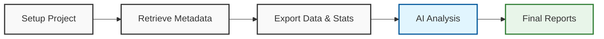

# Salesforce Org Analysis Kit


Automated framework for Salesforce org analysis, designed for **merger/acquisition due diligence** and **technical health assessments**. This kit combines metadata extraction with AI-driven analysis to identify technical debt, automation conflicts, and migration blockers.

---

## Overview

Merging Salesforce orgs requires deep visibility into what exists, what is used, and what is broken. This toolkit provides the raw data and structured AI prompts to turn a black-box org into a clear migration plan.

### Key Capabilities

| Feature | Description |
|---------|-------------|
| **Data Inventory** | Catalog record counts, identify empty tables, and calculate field usage statistics (population %). |
| **Metadata Analysis** | Detect "ghost metadata" (fields in XML but 0% usage), hard-coded IDs, and dormant automations. |
| **Security Audit** | Analyze Profile complexity, Permission Sets, and Sharing Models to assess access risks. |
| **Process Mapping** | Reverse-engineer sales and delivery processes based on Record Types and Stage history. |
| **Risk Assessment** | Flag critical migration blockers: Validation Rules, cross-object formulas, and dependencies. |

---

## Workflow



1.  **Retrieve**: Pull XML metadata using the Salesforce CLI.
2.  **Export**: Run Python scripts to sample data and calculate field population stats.
3.  **Analyze**: Feed the metadata and stats into an AI assistant using the provided prompts.

---

## Prerequisites

*   [Salesforce CLI (sf)](https://developer.salesforce.com/tools/salesforcecli)
*   [Python 3.x](https://www.python.org/downloads/)
*   [Git](https://git-scm.com/)

---

## Installation

1.  **Clone the repository**
    ```bash
    git clone https://github.com/designthynk/salesforce-org-analysis-kit.git
    cd salesforce-org-analysis-kit
    ```

2.  **Initialize the Project**
    Run the setup script with your target org alias (from `sf org list`).
    ```bash
    ./setup.sh [ORG_ALIAS]
    # Example: ./setup.sh my-org-prod
    ```
    *Creates directory structure, installs Python requirements, and generates custom scripts.*

---

## Usage Guide

### 1. Retrieve Metadata
Pull the specific metadata needed for analysis. The included package manifest focuses on high-value components.

```bash
sf project retrieve start --manifest templates/package.xml --target-org [ORG_ALIAS] --output-dir force-app/[ORG_ALIAS]
```

### 2. Export Data & Statistics
Run the generated Python script to export samples and calculate field usage.
*   **Input**: Org connection
*   **Output**: CSV samples and `field_stats.csv` in `scripts/data/`

```bash
python scripts/export_[ORG_ALIAS].py
```

### 3. Generate Analysis Reports
Open `docs/PROMPTS.md`. This file contains a sequence of prompts to feed into your AI assistant (ChatGPT, Claude, Cursor).

**Analysis Sequence:**

1.  **Setup**: Contextualize the AI with `Prompt 0`.
2.  **Task 1: Data Summary**: Inventory records and overall health.
3.  **Task 1.5: Security**: Analyze profiles and sharing rules.
4.  **Task 2: Data Model**: Map objects and business processes.
5.  **Task 3: Automation**: Audit flows, triggers, and validations.
6.  **Task 4: Tech Debt**: Identify unused fields and integrations.
7.  **Task 5: Final Report**: Generate the executive summary.

---

## Project Structure

```text
.
├── docs/
│   ├── PROMPTS.md          # Structured prompts for AI analysis
│   └── ai-instructions.md  # System context for the AI
├── templates/
│   ├── export_data.py      # Python script for data export & stats
│   ├── extract_metadata.py # XML parsing utility
│   └── package.xml         # Retrieval manifest
├── force-app/              # (Created) Storage for retrieved metadata
├── scripts/                # (Created) Storage for generated scripts & data
├── setup.sh                # Initialization script
└── requirements.txt        # Python dependencies
```

## License

This project is licensed under the MIT License - see the [LICENSE](LICENSE) file for details.
